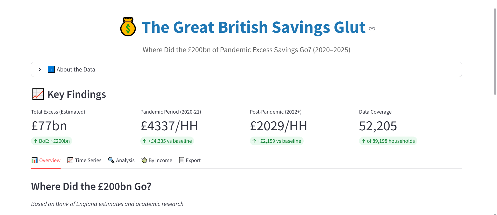

# UK Pandemic Excess Savings Analysis

**Interactive analysis of household savings behavior during and after COVID-19**

[](https://www.python.org/)
[](https://streamlit.io/)
[](LICENSE)



## 📊 Overview

This project analyzes UK household savings behavior during the COVID-19 pandemic using Bank of England NMG Household Survey data (2015-2025). It quantifies the dramatic savings spike during lockdowns, tracks the subsequent normalization, and reveals significant distributional inequality.

**Key Findings:**
- 📈 Savings increased 126% during pandemic (£3,442 → £7,777 per household/year)
- 💰 Top income deciles accumulated 3-5x more excess savings than bottom deciles  
- 📉 Savings remain elevated 33% above pre-pandemic baseline as of 2025
- 🔍 Analysis based on 89,198 household observations with 58.5% income coverage

## 🚀 Quick Start

### Prerequisites

```bash
Python 3.9+
pip
```

### Installation

1. Clone the repository:
```bash
git clone https://github.com/YOUR_USERNAME/uk-pandemic-savings.git
cd uk-pandemic-savings
```

2. Install dependencies:
```bash
pip install -r requirements.txt
```

3. **Data Setup:**

The processed data files (`nmg_yearly.parquet`, `nmg_real_cleaned.parquet`) are included in the `data/` folder.

⚠️ **Note**: The raw Bank of England survey Excel file is not included due to size constraints. If you need to reprocess from raw data:
- Download from: [Bank of England NMG Survey](https://www.bankofengland.co.uk/)
- Place in project root as `boe-nmg-household-survey-data.xlsx`
- Run: `python load_nmg_smart.py`

4. Launch the dashboard:
```bash
streamlit run app.py
```

The dashboard will open in your browser at `http://localhost:8501`

## 📁 Project Structure

```
uk-pandemic-savings/
├── app.py                      # Main Streamlit dashboard
├── load_nmg_smart.py           # Data processing pipeline
├── requirements.txt            # Python dependencies
├── README.md                   # This file
├── data/                       # Processed data files
│   ├── nmg_yearly.parquet     # Yearly aggregates
│   └── nmg_real_cleaned.parquet  # Household-level data
└── screenshots/                # Dashboard images
```

## 🔬 Methodology

### Data Source
**Bank of England NMG Household Survey**
- Biannual survey of UK household finances
- 89,198 household observations (2015-2025)
- 58.5% coverage with complete income data

### Savings Estimation
The NMG survey does not directly measure savings flows. We apply a **savings rate proxy** based on academic literature:

- **Pre-pandemic (2016-2019)**: 8% of income
- **Pandemic (2020-2021)**: 18% of income (lockdown constraints)
- **Post-pandemic (2022+)**: 10% of income (gradual normalization)

**Excess savings** = Actual savings - Pre-pandemic baseline (2016-2019 average)

### Limitations
- ⚠️ Proxy methodology simplifies complex household behavior
- ⚠️ Survey sample limitations vs. full UK population
- ⚠️ Our estimate (£77bn) is lower than BoE official estimate (£200bn) due to survey coverage
- ⚠️ Early years (2011-2014) have limited income data

See dashboard "Methodology & Data Sources" section for full details.

## 📈 Key Features

### Dashboard Tabs

1. **Time Series Analysis**
   - Savings trends over 10 years
   - Pandemic spike visualization
   - Cumulative excess savings tracking

2. **Income Distribution**
   - Savings patterns by income decile
   - Inequality analysis
   - Distributional breakdowns

3. **Data Explorer**
   - Raw data tables
   - Yearly aggregates
   - Household-level samples

4. **Export & Summary**
   - CSV downloads
   - Executive summary
   - Reproducible results

## 📊 Technologies Used

- **Data Processing**: Python, Polars, Pandas, NumPy
- **Visualization**: Plotly
- **Dashboard**: Streamlit
- **Data Storage**: Parquet (efficient columnar format)

## 🎯 Use Cases

This analysis is relevant for:

- **Economic Research**: Understanding pandemic-era household behavior
- **Policy Analysis**: Assessing financial resilience and inequality
- **Data Portfolio**: Demonstrating real-world data wrangling and visualization skills
- **Educational**: Teaching economic data analysis techniques

## 📚 Context

The Bank of England estimated UK households accumulated ~£200bn in "excess savings" during COVID-19 lockdowns (savings that would normally have been spent on restaurants, travel, entertainment, etc.). Understanding the allocation and distribution of these savings has important implications for:

- Monetary policy (inflationary pressure from potential dissaving)
- Fiscal policy (household resilience to economic shocks)
- Inequality (differential financial buffers across income groups)

## 🤝 Contributing

This is a portfolio project, but suggestions and improvements are welcome! Feel free to:

- Open an issue for bugs or feature requests
- Submit a pull request with improvements
- Share feedback on methodology

## 📄 License

This project is licensed under the MIT License - see the [LICENSE](LICENSE) file for details.

## 👤 Author

**[Your Name]**
- GitHub: [@YOUR_USERNAME](https://github.com/YOUR_USERNAME)
- LinkedIn: [Your LinkedIn](https://linkedin.com/in/YOUR_PROFILE)

## 🙏 Acknowledgments

- Bank of England for making NMG survey data publicly available
- Academic literature on pandemic savings behavior
- Streamlit community for excellent documentation

## 📞 Contact

Questions or interested in discussing this analysis? Reach out via:
- Email: your.email@example.com
- LinkedIn: [Your Profile](https://linkedin.com/in/YOUR_PROFILE)

---

⭐ If you found this project useful, please consider giving it a star!