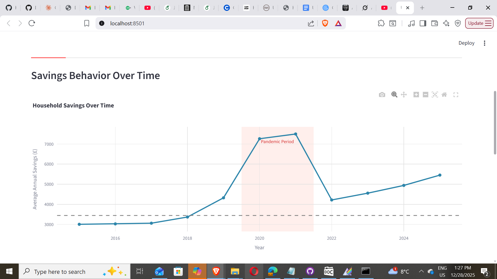

# UK Pandemic Savings Analysis

## What This Is

I'm studying economics and wanted to dig into how COVID lockdowns affected household savings in the UK. The Bank of England said people saved around £200bn during the pandemic, but I wanted to see if I could measure this myself and especially look at how it broke down by income level.

Ended up being a good excuse to learn Polars (way faster than Pandas) and build my first proper Streamlit dashboard.

## What I Found

Using the Bank of England's household survey data from 2015-2025:
- Average household savings more than doubled during lockdowns (£3,442 → £7,777/year)
- Rich households saved 3-5x more than poor households in absolute terms
- As of 2025, savings are still about 33% higher than pre-pandemic
- Working with 89k household observations, though only 58.5% had complete income data



## Running This Yourself

You'll need Python 3.9+ and pip.

**Setup:**
```bash
git clone https://github.com/YOUR_USERNAME/uk-pandemic-savings.git
cd uk-pandemic-savings
pip install -r requirements.txt
streamlit run app.py
```

The processed data is in the `data/` folder so it should just work. If you want to reprocess from scratch, download the raw Excel file from the [Bank of England NMG Survey](https://www.bankofengland.co.uk/), save it as `boe-nmg-household-survey-data.xlsx` in the project root, and run `python load_nmg_smart.py`.

## How It Works

The BoE survey doesn't actually track savings directly, so I had to estimate it. Based on what I could find in academic papers, I used these rough savings rates:
- Pre-pandemic (2016-2019): 8% of income
- Pandemic (2020-2021): 18% of income 
- Post-pandemic (2022+): 10% of income

Then I calculated "excess savings" as anything above the 2016-2019 baseline.

**Big caveats:**
- These savings rates are borrowed from papers, not derived from the data itself
- Survey coverage means my £77bn estimate is way lower than the BoE's £200bn
- I had to drop 41.5% of households that didn't report income
- Early years (2011-2014) have really limited data

## Project Structure

```
uk-pandemic-savings/
├── app.py                      # Streamlit dashboard
├── load_nmg_smart.py           # Data processing script
├── requirements.txt            
├── data/                       
│   ├── nmg_yearly.parquet     # Aggregated by year
│   └── nmg_real_cleaned.parquet  # Household-level
└── screenshots/                
```

## Dashboard Features

The Streamlit app has four tabs:
1. Time series showing the savings spike and recovery
2. Breakdown by income decile (really shows the inequality)
3. Data explorer where you can poke around the raw numbers
4. Export options and summary stats

## Tech Stack

Python, Polars (for data processing), Plotly (charts), Streamlit (dashboard), Parquet files (for storage)

## Issues & Future Work

- The savings rate proxy is pretty crude - would be better to derive these from actual spending data
- Dashboard layout could be cleaner
- Mobile view is a bit wonky
- Would love to add regional breakdowns if that data exists

## Context

During COVID lockdowns, people couldn't spend money on normal stuff (restaurants, holidays, etc.) so household savings shot up. The question is: where did all that money go, and who has it? This matters for understanding inflation risk (if people start spending it), financial resilience, and inequality.

## License

MIT - use this as required

## Contact

Sricharan Chandrasekhar
- GitHub: [@KashBlack](https://github.com/KashBlack)
- Email: sricharan.chandrasekhar@gmail.com
- LinkedIn: [sricharan-chandrasekhar](https://www.linkedin.com/in/sricharan-chandrasekhar-41a98534a/)

Feel free to open issues or PRs if you spot bugs or have ideas!

---

Data source: Bank of England NMG Household Survey
